# days 
## Overall Idea 
dayas is a Flutter mobile app designed to help users build and track daily habits in a structured way.
The core idea is simple: users can choose a role model, explore their daily routine, and then customize it to fit their own lifestyle.<br>
The app guides users through setting up tasks, following a routine, and tracking their progress throughout the day. As tasks are completed, users can mark them as done and earn rewards, making the experience more engaging. <br>
It also includes a social aspect, where users can connect and chat with others who share similar role models and goals.<br>
Overall, the app focuses on combining habit tracking, routine building, and light social interaction into one clean and easy-to-use experience.<br>

## Necessary Commands 
### Run: 
```bash
flutter pub get
flutter run
```
### To create a release build:
```bash
flutter build apk
flutter build ios
```

## Overall Flow
We have included a set of screenshots of the app and you get to see the overall flow of the app. 

### Login
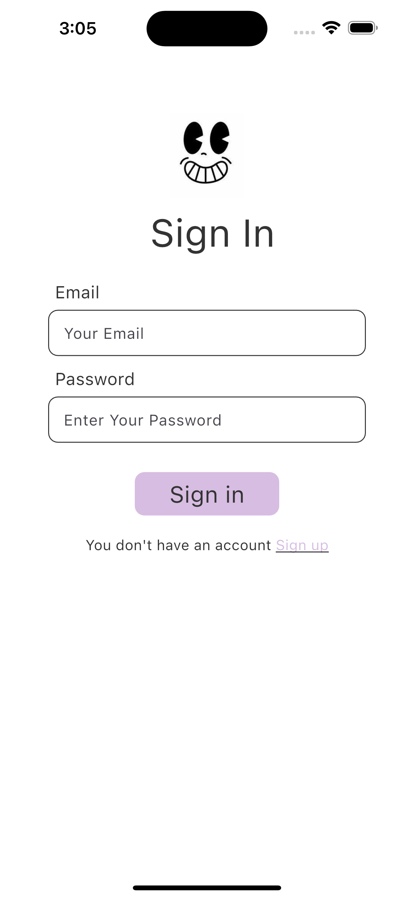

### Sign up 
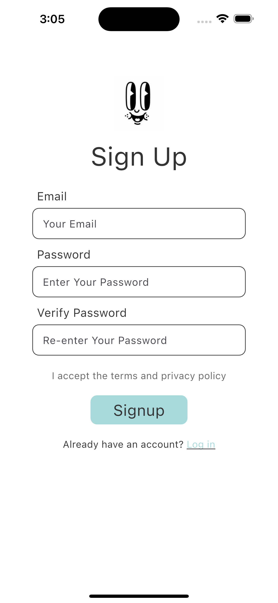

### Landing Page 
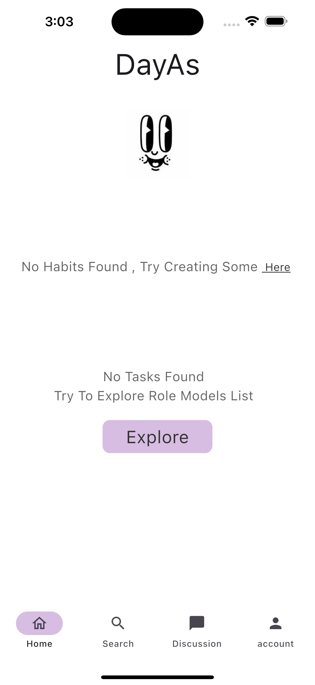
<br>
<br>
In this page you are set to define habits and track afterward. 

### Role Models Page 
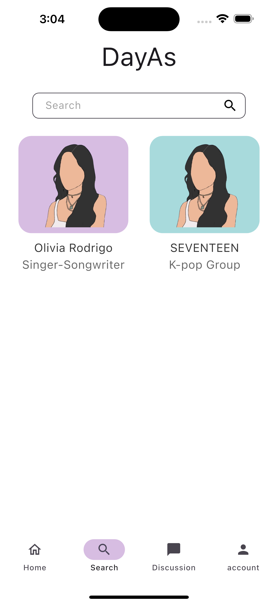
<br>
<br>
In this page you are set to pick a role model to find their day to day routine to follow for the day. 


### Role Models' Routine Page 
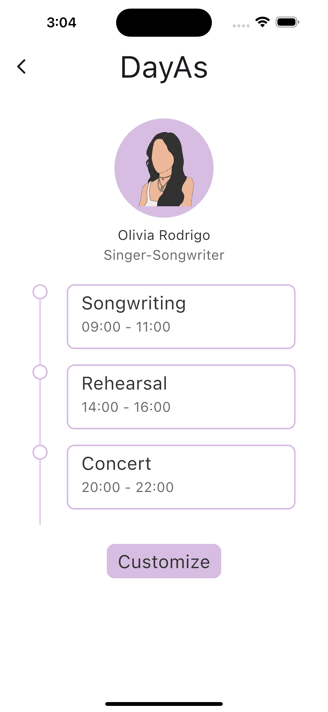
In this page, you get to take a peak at the routine of the role model and the overall flow of their day. 

### Routine Customization Page 

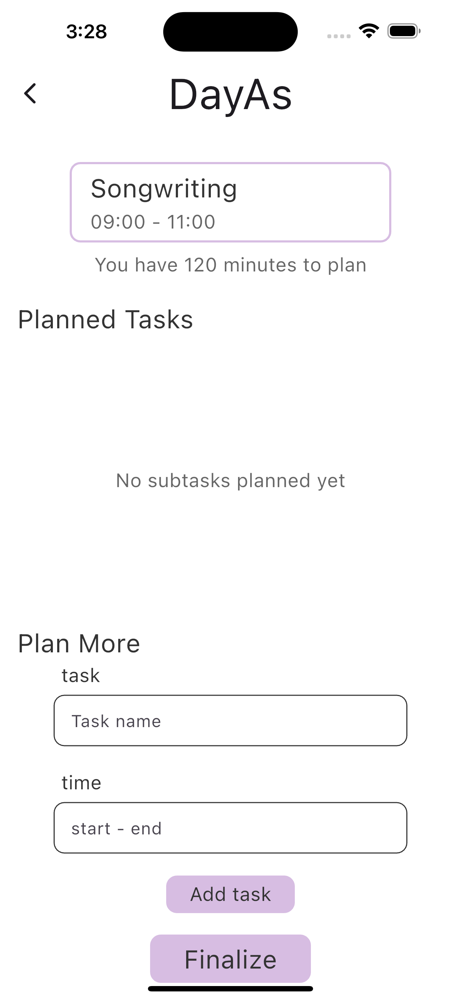
After seeing the routine of the role, you get to adjust the routine and add tasks that do reflect your overall background from job to relaxation and so on. 

### Customized Routine 
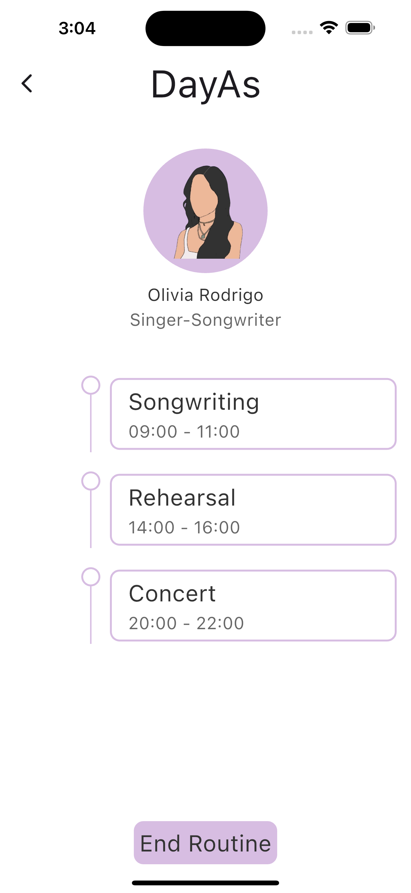

### Track Progress 
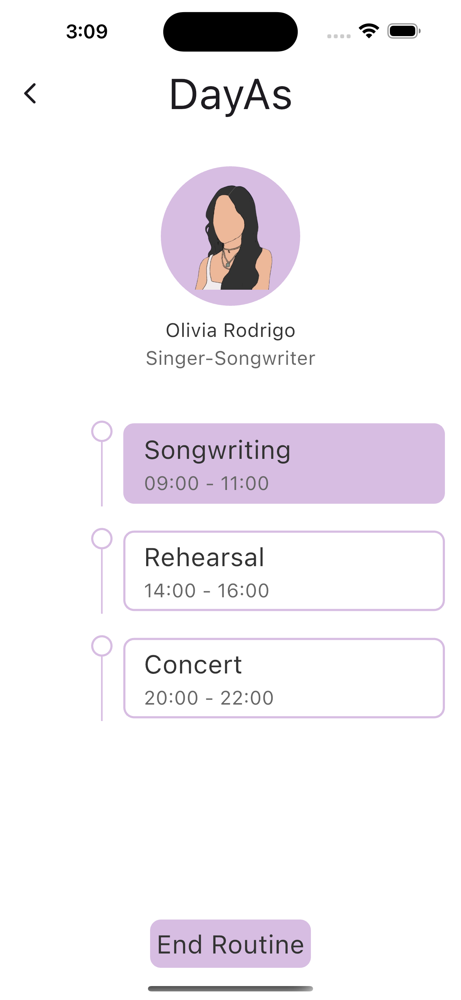
<br>
<br>
In this image you get to see the overall tasks that you have to do after customization and you can mark them done by double clicking on the task. 

### Claim The Reward 
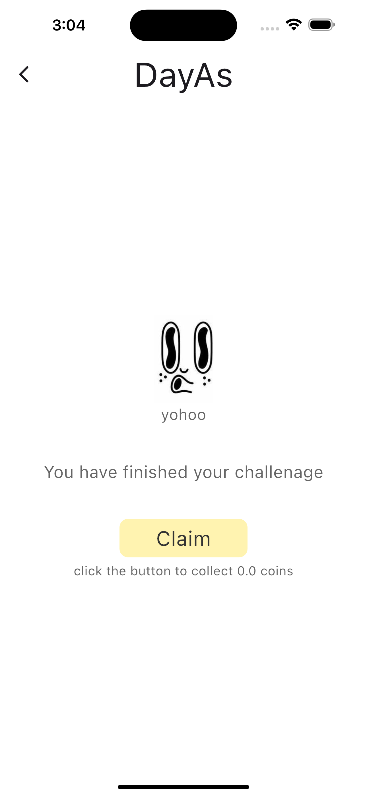
<br>
<br>
By ending the routine, you get to claim the coins that you have. 

### Chat Page 
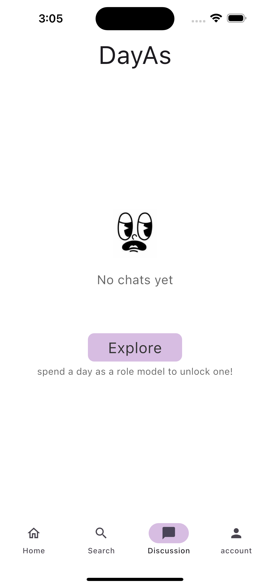
<br>
<br>
This page allows you to discuss with people that have the same role models and you get to enjoy a chit chat with people of similar interst. 

### Profile Page 
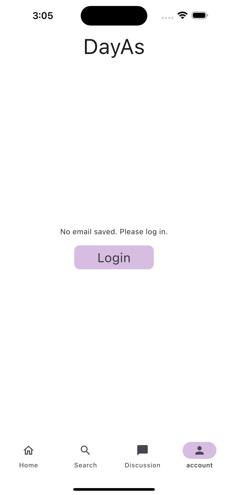


##### Note 
We will further include screenshots that will encoperate the version after linking with the backend side server. 